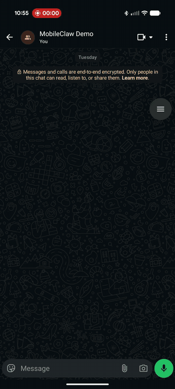

# MobileClaw

**Secure AI Agents on Android via Termux** — A NanoClaw fork with NemoClaw-inspired security.

MobileClaw runs AI agents on your phone with five-layer protection, operator approval via Android notifications, and native device integration.



## Quick Start (Termux on Android)

```bash
pkg install nodejs-lts proot termux-api git
git clone https://github.com/nj-1015/mobileclaw && cd mobileclaw
bash start.sh
```

The startup script installs dependencies, builds, and launches the agent. On first run it checks for Claude authentication — run `claude login` first if needed. Open `localhost:3002` in Chrome or connect WhatsApp via the onboarding wizard.

## What Changed from NanoClaw

| Component | NanoClaw | MobileClaw |
|-----------|----------|------------|
| Database | better-sqlite3 (native C++) | sql.js (WASM) |
| Sandbox | Docker containers | proot bind mounts |
| Auth | Credential proxy + placeholder tokens | Inherit host Claude Code auth |
| Channels | WhatsApp/Telegram/Slack/Discord | WhatsApp + Terminal + Web Chat UI |
| Security | Container isolation only | Five-layer protection model |
| Approval | Not present | Android notifications |
| CLI | Basic | `mobileclaw <name> <action>` |
| Skills | Standard | + Mobile (notifications, battery, clipboard, vibrate) |

## Architecture

```
WhatsApp / Browser (localhost:3002) / Terminal
    │
    ▼
Channels (WhatsApp, Web SSE, Terminal REPL)
    │
    ▼
MobileClaw Orchestrator (SQLite via sql.js)
    │
    ▼
proot Sandbox (filesystem isolation)
    │
    ▼
Claude Agent SDK (query)
    │
    ├── MCP: mobileclaw (IPC, messaging, tasks)
    └── MCP: mobile (device_info, notifications, network approval)
```

## Five-Layer Protection

| Layer | Type | Description |
|-------|------|-------------|
| 1. Filesystem | Locked | proot bind mounts, glob allow/deny patterns |
| 2. Process | Locked | Command filter, ulimits, Termux:API blocklist |
| 3. Network | Hot-reload | HTTP proxy + DNS monitor, domain allowlist, operator approval |
| 4. Tool Approval | Per-tool | MCP tool gating via Android notifications |
| 5. Inference | Hot-reload (opt-in) | Local/cloud routing, cost tracking, daily budget |

## Demo Flow

1. Add the agent to a WhatsApp group
2. **"@Macha Hi"** → agent greets you by name
3. **"@Macha what's the weather in Orlando?"** → notification: **[Allow Once] [Always Allow] [Block]** for google.com → tap Allow → weather response
4. **"@Macha plan me a 7-day trip"** → agent creates a travel plan and saves it to Downloads
5. All network requests require your explicit approval via Android notification

## Key Files

```
src/
├── db.ts                    # sql.js wrapper (better-sqlite3 compat)
├── container-runtime.ts     # proot runtime (was Docker)
├── container-runner.ts      # Sandbox spawner (proot --bind)
├── channels/
│   ├── whatsapp.ts          # WhatsApp channel (Baileys)
│   ├── gmail.ts             # Gmail channel (tool-only, OAuth)
│   ├── terminal.ts          # CLI channel
│   └── web.ts               # Browser chat UI (localhost:3002)
├── blueprints/
│   ├── schema.ts            # Zod blueprint validation
│   ├── loader.ts            # YAML load + digest verify
│   ├── planner.ts           # Resource checks
│   └── apply.ts             # Create agent from blueprint
├── protection/
│   ├── filesystem.ts        # Layer 1: proot sandbox
│   ├── process.ts           # Layer 2: command filter
│   ├── network.ts           # Layer 3: HTTP proxy + DNS monitor
│   └── inference.ts         # Layer 5: local/cloud gateway (opt-in)
├── approval/
│   ├── operator.ts          # Layer 4: Android notification approval
│   └── cli.ts               # CLI approval handler
├── skills/
│   ├── mobile-tools.ts      # Termux:API tools
│   └── mcp-mobile.ts        # MCP server for mobile tools
└── cli/
    ├── index.ts             # mobileclaw CLI entry point
    ├── onboard.ts           # Interactive setup wizard
    └── commands.ts          # Agent lifecycle commands

blueprints/
├── conservative.yaml        # Strict lockdown
├── developer.yaml           # GitHub/npm/docs access
└── airgapped.yaml           # Fully offline
```

## Requirements

- Android device
- Termux (F-Droid)
- Termux:API app (F-Droid) — for notifications, battery, clipboard
- `termux-api` package
- Node.js 20+ (`pkg install nodejs-lts`)
- proot (`pkg install proot`)
- Claude Code authentication (OAuth or API key)

## Credits

- **NanoClaw** (baseline): [github.com/qwibitai/nanoclaw](https://github.com/qwibitai/nanoclaw)
- **[NemoClaw](https://github.com/NVIDIA/NemoClaw)** (architecture inspiration): NVIDIA's defense-in-depth security model
- Built with Claude Code in Termux

## License

MIT
